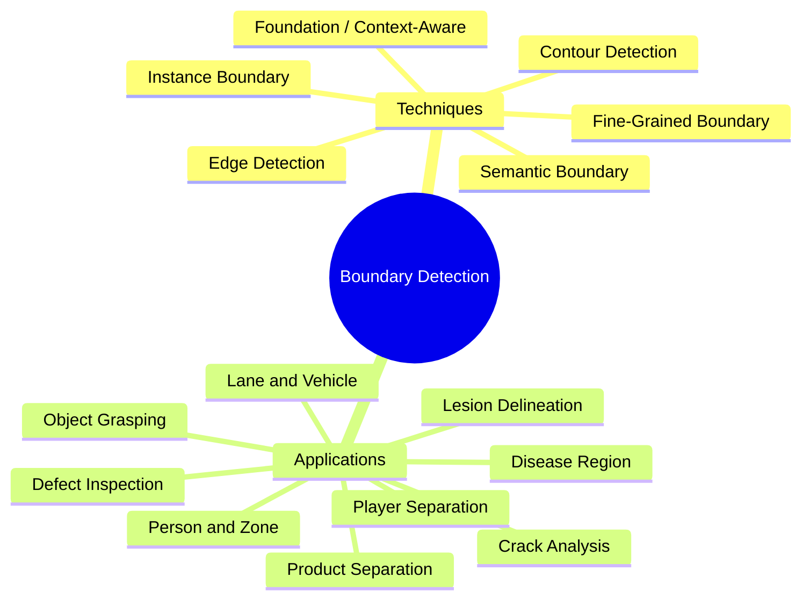
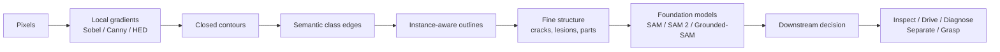
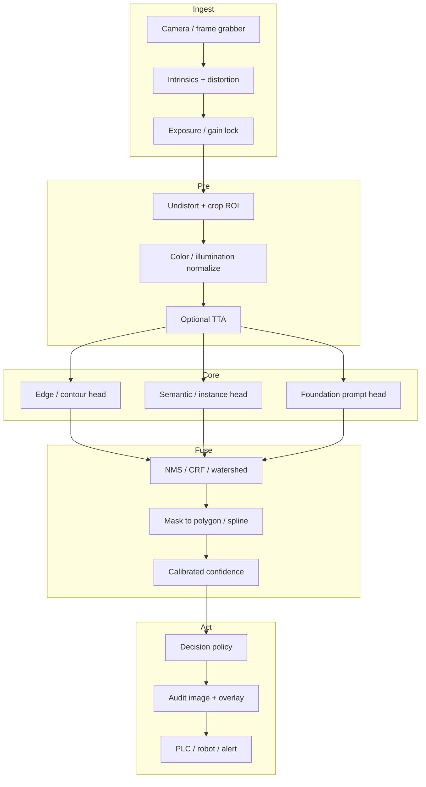
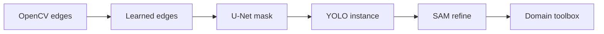

# educationalb

**Boundary Detection in Computer Vision — from pixels and edges to precise object and region understanding.**

[](LICENSE)
[](#catalog-5-github-repos-per-topic)
[](#catalog-5-github-repos-per-topic)
[](https://github.com/ahmaddroobi99)

This repository is an educational map of the topics in the *Boundary Detection in Computer Vision* infographic:

- **6 key techniques** for finding and understanding boundaries
- **9 real-world applications** where those boundaries change industrial outcomes
- **5 curated GitHub repositories per topic** (75 links)
- **System-design principles** for building a production boundary pipeline
- Diagrams, images, and demo GIFs from canonical open-source projects

> Where does an object actually end? For a computer-vision system, that question is not a box. It is a boundary: a 1-pixel decision with downstream effects on inspection, driving, surgery, sport, and grasping.

<p align="center">
  
</p>

<p align="center"><em>Interactive foundation-model boundaries — Meta Segment Anything demo GIF.</em></p>

---

## Table of contents

1. [Map of the field](#map-of-the-field)
2. [Visual intuition](#visual-intuition)
3. [System design — basic principles](#system-design--basic-principles)
4. [Catalog: 5 GitHub repos per topic](#catalog-5-github-repos-per-topic)
5. [How to study this catalog](#how-to-study-this-catalog)
6. [License and attribution](#license-and-attribution)

---

## Map of the field





The six techniques are not competitors. They are layers of a stack. Classic edges are cheap and interpretable. Contours close those edges into objects. Semantic boundaries attach class meaning. Instance boundaries split people into *this person* and *that person*. Fine-grained methods recover thin structures. Foundation models make the stack promptable and transferable.

---

## Visual intuition

Foundation-model mask quality (Meta SAM assets):

<p align="center">
  
</p>

How a promptable segmenter is wired:

<p align="center">
  
</p>

Classic local edges still matter. They are the first layer you should implement before you train anything:

```text
I(x, y)
   |  Gaussian blur sigma
   v
dI/dx , dI/dy          Sobel / Scharr
   |
   v
G = sqrt(Gx^2 + Gy^2)    gradient magnitude
theta = atan2(Gy, Gx)    orientation
   |
   v
non-maximum suppression + hysteresis   Canny
   |
   v
edge map -> contour tracing -> polygon / mask
```

---

## System design — basic principles

A staff-level boundary system is not "run Canny" or "run SAM". It is a pipeline with contracts.



### 1. Define the boundary you actually need

| Question | Why it matters |
| --- | --- |
| Pixel-accurate or box-accurate? | Inspection and grasping need pixels. Tracking often needs boxes. |
| Class-aware? | Any edge is not a lane-marking edge. |
| Instance-aware? | Two apples that touch are one blob to a semantic model. |
| Thin structure? | Cracks and vessels die under downsampling. |
| Real-time? | Canny at 1 ms vs SAM at tens of ms changes the architecture. |

Write the contract first: input resolution, latency budget, IoU / F1 / ODS / OIS target, false-positive cost.

### 2. Separate geometry from semantics

- **Geometry** answers where intensity or depth changes.
- **Semantics** answers what is on each side of that change.
- **Instances** answer how many distinct objects share that class.

Do not force one network to invent all three if your data cannot supervise all three.

### 3. Keep resolution where the boundary lives

Thin defects, lanes at distance, and medical lesions live in high-frequency bands.

- Avoid aggressive center-crop + 1/32 feature maps if the object is 3 px wide.
- Prefer skip connections, dilated convs, HRNet-style parallel streams, or mask refinement heads.
- Measure boundary F-score (trimap / BF score), not only mIoU. mIoU can look fine while edges are mush.

### 4. Calibrate, then decide

A raw mask is not a decision.

```text
mask  ->  area / width / circularity / Hausdorff
      ->  calibrated score
      ->  threshold with cost matrix
      ->  human-in-the-loop if near the margin
```

Industrial and medical systems fail on confident wrong boundaries, not on silent "I don't know".

### 5. Treat prompts as an API

Foundation models (SAM family) turn clicks, boxes, and text into masks. In production:

- The prompt source must be deterministic (detector box, previous track, operator click).
- Log the prompt with the mask. Otherwise you cannot debug.
- Constrain the mask to a ROI and a class prior. Unconstrained SAM will happily segment the wrong object.

### 6. Make the output a geometry object, not only a bitmap

Downstream systems want:

- polygons (Shapely / GeoJSON)
- polylines (lanes, cracks)
- splines (lesion contours)
- grasp rectangles or 6-DoF poses

Store both the mask and the vector. Bitmaps do not compose well with CAD, PLC, or robot planners.

### 7. Evaluate on the failure mode of the industry

| Domain | Metric that actually hurts |
| --- | --- |
| Defect / crack | missed thin positives, pixel recall on the crack skeleton |
| Lane | departure of fitted polyline vs centerline at range |
| Product separation | merged instances (under-segmentation) |
| Lesion | Hausdorff distance, not only Dice |
| Grasping | grasp success, not mask IoU |
| Person / zone | ID switches at the zone boundary |

### 8. Production constraints that papers skip

- Lighting drift and dirt on the lens
- Motion blur and rolling shutter
- Domain shift (new SKU, new road paint, new scanner)
- Safety interlock: do not act on an unvalidated mask
- Overlay latency: operators trust what they can see
- Dataset governance: medical and factory images are not free to publish

Longer notes live in [`docs/system-design.md`](docs/system-design.md).

---

## Catalog: 5 GitHub repos per topic

Star counts move. The lists below privilege **canonical code, papers with implementations, and toolboxes you can actually run**. Overlap across topics is intentional: a production stack reuses Detectron2, Ultralytics, OpenCV, and SAM.

Machine-readable copy: [`catalog/repos.json`](catalog/repos.json).

### A. Six key techniques

#### 1. Edge Detection

Local and learned intensity discontinuities. Start here.

| # | Repository | Why it is here |
| --- | --- | --- |
| 1 | [opencv/opencv](https://github.com/opencv/opencv) | Canny, Sobel, Scharr, Laplacian — the baseline every paper still beats |
| 2 | [xavysp/DexiNed](https://github.com/xavysp/DexiNed) | Dense extreme inception network for crisp learned edges |
| 3 | [hellozhuo/pidinet](https://github.com/hellozhuo/pidinet) | Pixel-difference networks; efficient edge detection (ICCV 2021 oral) |
| 4 | [sniklaus/pytorch-hed](https://github.com/sniklaus/pytorch-hed) | Clean PyTorch Holistically-Nested Edge Detection |
| 5 | [MarkMoHR/Awesome-Edge-Detection-Papers](https://github.com/MarkMoHR/Awesome-Edge-Detection-Papers) | Living index of datasets, classic and deep edge / contour / boundary papers |

#### 2. Contour Detection

Closing edges into object-shaped curves.

| # | Repository | Why it is here |
| --- | --- | --- |
| 1 | [opencv/opencv](https://github.com/opencv/opencv) | `findContours`, hierarchy, approxPolyDP, moments |
| 2 | [wangyuxin87/ContourNet](https://github.com/wangyuxin87/ContourNet) | Learned contours for arbitrary-shaped objects |
| 3 | [CihanTopal/ED_Lib](https://github.com/CihanTopal/ED_Lib) | Edge Drawing family: segments, lines, circles from edge chains |
| 4 | [backseason/PoolNet](https://github.com/backseason/PoolNet) | Salient-object contours via pooling design |
| 5 | [Raj-08/tensorflow-object-contour-detection](https://github.com/Raj-08/tensorflow-object-contour-detection) | Encoder-decoder object-contour baseline |

#### 3. Semantic Boundary Detection

Edges that know the class on each side (road vs sidewalk, organ vs background).

| # | Repository | Why it is here |
| --- | --- | --- |
| 1 | [Chrisding/seal](https://github.com/Chrisding/seal) | SEAL — simultaneous edge alignment and learning |
| 2 | [WHU-USI3DV/Mobile-Seed](https://github.com/WHU-USI3DV/Mobile-Seed) | Joint semantic segmentation and boundary detection for mobile robots |
| 3 | [open-mmlab/mmsegmentation](https://github.com/open-mmlab/mmsegmentation) | Production semantic-seg toolbox; many models expose boundary-aware losses |
| 4 | [PaddlePaddle/PaddleSeg](https://github.com/PaddlePaddle/PaddleSeg) | Strong boundary-aware industrial segmentation zoo |
| 5 | [MarkMoHR/Awesome-Edge-Detection-Papers](https://github.com/MarkMoHR/Awesome-Edge-Detection-Papers) | Dedicated semantic-edge section (CASENet, DFF, STEAL, RINDNet) |

#### 4. Instance Boundary Detection

One mask per object, even when objects share a class and touch.

| # | Repository | Why it is here |
| --- | --- | --- |
| 1 | [facebookresearch/detectron2](https://github.com/facebookresearch/detectron2) | Mask R-CNN family, PointRend, panoptic baselines |
| 2 | [ultralytics/ultralytics](https://github.com/ultralytics/ultralytics) | YOLO segment models — fastest path from image to instance polygon |
| 3 | [open-mmlab/mmdetection](https://github.com/open-mmlab/mmdetection) | Broad instance-seg zoo (Mask R-CNN, SOLOv2, QueryInst) |
| 4 | [matterport/Mask_RCNN](https://github.com/matterport/Mask_RCNN) | The educational Mask R-CNN implementation most tutorials still cite |
| 5 | [facebookresearch/Mask2Former](https://github.com/facebookresearch/Mask2Former) | Unified mask-classification for instance / semantic / panoptic |

#### 5. Fine-Grained Boundary Detection

Thin structures: cracks, vessels, leaf lesions, part edges.

| # | Repository | Why it is here |
| --- | --- | --- |
| 1 | [HRNet/HRNet-Semantic-Segmentation](https://github.com/HRNet/HRNet-Semantic-Segmentation) | High-resolution streams that keep fine edges alive |
| 2 | [NVlabs/SegFormer](https://github.com/NVlabs/SegFormer) | Hierarchical transformer encoder with lightweight MLP decoder |
| 3 | [yhlleo/DeepSegmentor](https://github.com/yhlleo/DeepSegmentor) | DeepCrack + RoadNet — thin structure segmentation |
| 4 | [milesial/Pytorch-UNet](https://github.com/milesial/Pytorch-UNet) | The skip-connection template for fine biomedical boundaries |
| 5 | [open-mmlab/mmsegmentation](https://github.com/open-mmlab/mmsegmentation) | PIDNet, STDC, SegFormer configs used for high-frequency edges |

#### 6. Context-Aware / Foundation Boundary Detection

Promptable, open-world masks from large vision models.

| # | Repository | Why it is here |
| --- | --- | --- |
| 1 | [facebookresearch/segment-anything](https://github.com/facebookresearch/segment-anything) | SAM — the foundation click-to-mask model |
| 2 | [facebookresearch/sam2](https://github.com/facebookresearch/sam2) | SAM 2 — images and video, memory for temporal boundaries |
| 3 | [IDEA-Research/Grounded-Segment-Anything](https://github.com/IDEA-Research/Grounded-Segment-Anything) | Text / box prompts grounded into SAM masks |
| 4 | [CASIA-LMC-Lab/FastSAM](https://github.com/CASIA-LMC-Lab/FastSAM) | Real-time approximation of the SAM interface |
| 5 | [facebookresearch/sam3](https://github.com/facebookresearch/sam3) | Next SAM generation — inference and finetune entry point |

---

### B. Nine real-world applications

#### 7. Defect Inspection — manufacturing

| # | Repository | Why it is here |
| --- | --- | --- |
| 1 | [open-edge-platform/anomalib](https://github.com/open-edge-platform/anomalib) | Industrial anomaly / defect library with localization masks |
| 2 | [M-3LAB/awesome-industrial-anomaly-detection](https://github.com/M-3LAB/awesome-industrial-anomaly-detection) | Paper + dataset map for factory defects |
| 3 | [amazon-science/patchcore-inspection](https://github.com/amazon-science/patchcore-inspection) | PatchCore — strong few-shot industrial baseline |
| 4 | [openvinotoolkit/anomalib](https://github.com/openvinotoolkit/anomalib) | Edge-deployable lineage of Anomalib |
| 5 | [yhlleo/DeepSegmentor](https://github.com/yhlleo/DeepSegmentor) | Supervised thin-defect segmentation when you do have labels |

#### 8. Lane and Vehicle Understanding — transportation

| # | Repository | Why it is here |
| --- | --- | --- |
| 1 | [MaybeShewill-CV/lanenet-lane-detection](https://github.com/MaybeShewill-CV/lanenet-lane-detection) | LaneNet instance-lane classic |
| 2 | [hustvl/YOLOP](https://github.com/hustvl/YOLOP) | Joint vehicle det + drivable area + lane |
| 3 | [cfzd/Ultra-Fast-Lane-Detection](https://github.com/cfzd/Ultra-Fast-Lane-Detection) | Structure-aware real-time lanes |
| 4 | [amusi/awesome-lane-detection](https://github.com/amusi/awesome-lane-detection) | Paper list and dataset compass |
| 5 | [voldemortX/pytorch-auto-drive](https://github.com/voldemortX/pytorch-auto-drive) | Unified lane + driving-seg benchmark harness |

#### 9. Product Separation — retail, commerce, logistics

| # | Repository | Why it is here |
| --- | --- | --- |
| 1 | [ultralytics/ultralytics](https://github.com/ultralytics/ultralytics) | YOLO-seg for SKU / carton instance cuts |
| 2 | [roboflow/supervision](https://github.com/roboflow/supervision) | Polygon annots, IoU, zone logic on top of any detector |
| 3 | [facebookresearch/detectron2](https://github.com/facebookresearch/detectron2) | Heavy instance-seg when boxes are not enough |
| 4 | [wkentaro/labelme](https://github.com/wkentaro/labelme) | Polygon annotation that becomes your ground-truth boundary |
| 5 | [CVHub520/X-AnyLabeling](https://github.com/CVHub520/X-AnyLabeling) | SAM-assisted labeling for product outlines |

#### 10. Lesion Delineation — healthcare

| # | Repository | Why it is here |
| --- | --- | --- |
| 1 | [MIC-DKFZ/nnUNet](https://github.com/MIC-DKFZ/nnUNet) | Self-configuring SOTA for medical delineation |
| 2 | [Project-MONAI/MONAI](https://github.com/Project-MONAI/MONAI) | Clinical-grade transforms, metrics, and sliding-window infer |
| 3 | [milesial/Pytorch-UNet](https://github.com/milesial/Pytorch-UNet) | Minimal U-Net you can read in an afternoon |
| 4 | [Beckschen/TransUNet](https://github.com/Beckschen/TransUNet) | Transformer encoder + U-Net decoder for organs / lesions |
| 5 | [JunMa11/SegLossOdyssey](https://github.com/JunMa11/SegLossOdyssey) | Boundary-sensitive losses (Hausdorff, clDice) |

#### 11. Disease Region Detection — agriculture / environment

| # | Repository | Why it is here |
| --- | --- | --- |
| 1 | [spMohanty/PlantVillage-Dataset](https://github.com/spMohanty/PlantVillage-Dataset) | Canonical leaf-disease image set |
| 2 | [PaddlePaddle/PaddleSeg](https://github.com/PaddlePaddle/PaddleSeg) | Practical agricultural segmentation models |
| 3 | [open-mmlab/mmsegmentation](https://github.com/open-mmlab/mmsegmentation) | Train custom canopy / lesion parsers |
| 4 | [ultralytics/ultralytics](https://github.com/ultralytics/ultralytics) | Fast disease-spot instance baselines |
| 5 | [facebookresearch/sam2](https://github.com/facebookresearch/sam2) | Promptable field / leaf region masks when labels are scarce |

#### 12. Crack Analysis — infrastructure / smart cities

| # | Repository | Why it is here |
| --- | --- | --- |
| 1 | [yhlleo/DeepSegmentor](https://github.com/yhlleo/DeepSegmentor) | DeepCrack reference implementation |
| 2 | [KangchengLiu/Crack-Detection-and-Segmentation-Dataset-for-UAV-Inspection](https://github.com/KangchengLiu/Crack-Detection-and-Segmentation-Dataset-for-UAV-Inspection) | UAV crack imagery + segmentation |
| 3 | [dimitrisdais/crack_detection_CNN_masonry](https://github.com/dimitrisdais/crack_detection_CNN_masonry) | Masonry crack classification and segmentation |
| 4 | [arthurflor23/surface-crack-detection](https://github.com/arthurflor23/surface-crack-detection) | Surface-crack DL starter |
| 5 | [konskyrt/Concrete-Crack-Detection-Segmentation](https://github.com/konskyrt/Concrete-Crack-Detection-Segmentation) | Concrete crack detection + segmentation notebook |

#### 13. Player Separation — media, sports, entertainment

| # | Repository | Why it is here |
| --- | --- | --- |
| 1 | [ultralytics/ultralytics](https://github.com/ultralytics/ultralytics) | Player instance masks + track IDs |
| 2 | [ifzhang/ByteTrack](https://github.com/ifzhang/ByteTrack) | Association that keeps identities when players occlude |
| 3 | [mikel-brostrom/boxmot](https://github.com/mikel-brostrom/boxmot) | Pluggable multi-object trackers on YOLO/seg |
| 4 | [open-mmlab/mmtracking](https://github.com/open-mmlab/mmtracking) | Research tracking toolbox (VIS / MOT) |
| 5 | [SoccerNet](https://github.com/SoccerNet) | Sports perception datasets and baselines (org) |

#### 14. Person and Zone Understanding — security, public space

| # | Repository | Why it is here |
| --- | --- | --- |
| 1 | [roboflow/supervision](https://github.com/roboflow/supervision) | Polygon zones, dwell time, line-crossing on live streams |
| 2 | [DeepLabCut/DeepLabCut](https://github.com/DeepLabCut/DeepLabCut) | Keypoints that define a person-centric region |
| 3 | [ultralytics/ultralytics](https://github.com/ultralytics/ultralytics) | Person detect / segment / pose in one API |
| 4 | [open-mmlab/mmpose](https://github.com/open-mmlab/mmpose) | Pose to body polygon / activity zone |
| 5 | [mikel-brostrom/boxmot](https://github.com/mikel-brostrom/boxmot) | Persistent IDs across a restricted zone |

#### 15. Object Grasping — robotics / autonomy

| # | Repository | Why it is here |
| --- | --- | --- |
| 1 | [graspnet/graspnet-baseline](https://github.com/graspnet/graspnet-baseline) | GraspNet-1Billion baseline on object point clouds |
| 2 | [GeorgeDu/vision-based-robotic-grasping](https://github.com/GeorgeDu/vision-based-robotic-grasping) | Survey of vision-grasp papers and code |
| 3 | [andyzeng/visual-pushing-grasping](https://github.com/andyzeng/visual-pushing-grasping) | Learn push + grasp from visual state |
| 4 | [atenpas/gpd](https://github.com/atenpas/gpd) | Classic 6-DoF grasp pose detection in clouds |
| 5 | [skumra/robotic-grasping](https://github.com/skumra/robotic-grasping) | Antipodal grasps with GR-ConvNet |

---

## How to study this catalog

Suggested order if you are building intuition, not chasing a leaderboard:

1. Run **Canny + findContours** in OpenCV on one of your own photos.
2. Reproduce **HED or DexiNed** and compare the edge map to Canny.
3. Train a tiny **U-Net** on a binary mask task (crack or leaf).
4. Run **YOLOv8/YOLO11-seg** and export polygons.
5. Prompt **SAM / SAM 2** with those polygons as boxes.
6. Only then specialize (Anomalib, LaneNet, nnU-Net, GraspNet).



---

## Project layout

```text
educationalb/
├── README.md                 <- you are here
├── LICENSE
├── CONTRIBUTING.md
├── catalog/
│   └── repos.json            <- 15 topics x 5 repos
└── docs/
    └── system-design.md      <- expanded design notes
```

This repo **curates** upstream projects. It does not vendor their code. Clone the upstream repository when you want to train or infer.

---

## License and attribution

- This catalog is released under the [MIT License](LICENSE).
- Linked repositories keep **their own licenses**. Read them before commercial use (AGPL on Ultralytics, research licenses on some Meta checkpoints, etc.).
- Demo GIF and SAM diagrams are from [facebookresearch/segment-anything](https://github.com/facebookresearch/segment-anything) and remain copyright of their authors.
- Topic taxonomy follows the public Boundary Detection in Computer Vision educational graphic (Visual Grab / Dr Raj Gupta).

Maintained as study notes by [Ahmad Droobi](https://github.com/ahmaddroobi99).
